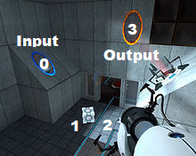

# SISOP 2019 : Modul 2 [Soal Shift] Kelompok D8

## #1 grey_.png dan pindah
### Pembuatan
* Inisialisasi variabel:
    ```c
	DIR *d;
	struct dirent *dir;
	char dir_o[100] = "/home/agarpac/Pictures/", 
		dir_n[100] = "/home/agarpac/modul2/gambar/", 
		dir_e1[100], dir_e2[100],
		replacement[10] = "_grey", 
		extension[5] = ".png",
		*attach, *fname;
    ```
    `dir_o` dan `dir_n` adalah default direktori yang akan digunakan.
    
    untuk `dir_e[1-2]` akan berubah terus (full diretory of filename).
    
    `replacement` untuk memberikan tambahan `_grey` dan `extension` untuk akhir filename (karena `replacement`).
    
* Buildup the string
    `strcpy` dan `strcat` adalah kunci untuk manipulasi string yang akan disimpan dalam `dir_e`!
    > Untuk membentuk string `sumber` dan `target`, akan menggunakan variabel `dir_o` dan `dir_n` respectively sebagai basis.
    
    Setelah itu, saatnya rename:
    ```c
    rename(dir_e1, dir_e2);
    ```

## #2 Lupakan elen.ku
### Pembuatan
* Pencarian elen.ku (dan kendala)

	
	
    Terdapat banyak `pemeriksaan`
    
    Dibagi menjadi poin penting berikut;
    * mencari nama file `elen.ku`
        ```c
        attach = strstr(dir->d_name, "elen.ku");
		if(attach != NULL)
        ```
    * mencari `user` dari file tersebut (untuk mendapatkan `uid`)
    
        note : `str` dialokasikan memori supaya tidak `segment error`
        ```c
        strcpy(str, tempat);
		strcat(str, dir->d_name);
		if (stat(str, &buf) == 0)
        ```
        Setelah itu, dapatkan data dari user tersebut (untuk mendapatkan `user name`)
        ```c
        p = getpwuid(buf.st_uid);
        ```
    * apakah `user owner` = `www-data` (pembanding)?
        ```c
        char uname[100] = "";
		stpcpy(uname, p->pw_name);
		if(strcmp(uname, pembanding) == 0)
        ```
    Belum mendapatkan solusi yang lebih pendek.
* chmod-ing
    ```c
    chmod (str, 777)
    ```
    `777` berarti akses untuk seluruh user(?).
### Waktu sebelum lanjut loop?
```c
sleep(3);
```
Ini akan berjalan dalam `daemon`.

## #3 Extract dan listing file
### Pembuatan
* fork()-ing

    ada 3 variabel yang digunakan untuk `fork()`ing. Tidak ada perbedaan dengan penggunaan 1 variabel selain visual dalam kodingan.
* pipe
    > Mengimplementasikan `pipe` dalam C ribet.

    Karena itu, pencarian referensi dilakukan.
    Sumber : http://www.cs.loyola.edu/~jglenn/702/S2005/Examples/dup2.html
    
    ` 0>||>1`  `2>||>3 `
    
    Untuk 2 pipe
    
    Ganjil mempresentasikan `Output` Genap mempresentasikan `Input` (bergantung perspektif).
    
    Dalam perspektektif fungsi;
    * Hasil dari `ls` akan dimasukkan ke pipe lubang 1 (output)
    
        `(f) >1||`
    * Input didapat dari lubang 0 dan output dipasang ke lubang 3 agar setelah `grep` proses, bisa output ke pipe selanjutnya
	
		
    
        `||0> (f) >3||`
    * Lubang 2 tetap dibuka supaya hasil dari pipe bisa dipakai (karena tidak memakai `exec`).
    
        `||2= (f)`
* output terakhir

    Untuk mengoutput menjadi file, lakukan berikut ini;
    
    Simpan apa dalam `output pipe` ke dalam variabel
    ```c
    char filetxt[1000];
	read(pipefd[2],filetxt,sizeof(filetxt));
	close(pipefd[2]);
	```
	Menyimpan variabel yang tersimpan kepada `text file`
	```c
	FILE *out = fopen("daftar.txt","w+");
	fputs(filetxt, out);
	fclose(out);
    ```
## #4 Makan Sehat
### Pembuatan
* Membuat Daemon

Daemon digunakan agar program dapat dijalankan setiap 5 detik sekali. 

* Menentukan path dari file

Path dari file yang akan dicek diletakkan didalam string `pathFile`
```c
char pathFile[] = "home/bryan/Documents/makanan/makan_enak.txt";
int namafile = 1;
```
variabel `namafile` berisi bilangan untuk dijadikan nama dari file makan_sehat.txt

* Stat & waktu file

Struct `stat` digunakan untuk menyimpan segala informasi dari sebuah file 
```c
struct stat statFile;
stat (pathFile, &statFile);
time_t timeFile2 = statFile.st_atime;
```
`st_atime` berisi waktu saat file tersebut terakhir kali diakses

* Pembuatan file
```c
if (difftime(time(NULL), timeFile2) <= 30) {
}
```
`if (difftime(time(NULL), timeFile2) <= 30)` untuk mengecek apakah `timeFile2` (waktu file dibuka) selama 30 detik kebelakang, relatif dari program dijalankan `time(NULL)`
```c
char pathHasil[]="/home/bryan/Documents/makanan/makan_sehat";
snprintf(pathHasil + strlen(pathHasil), PANJANG - strlen(pathHasil), "%d%s", namafile, ".txt");
FILE *hasil = fopen(pathHasil, "w");
fclose(hasil);
namafile++;
```
Kode untuk membuat dan memberi nama file yang berbeda pada setiap iterasi, dengan menggunakan variabel `namafile`

* Melakukan eksekusi program setiap 5 detik
```c
	sleep(5);
```
## #5 Log.log
### Pembuatan
* Penjelasan program

Program akan menjalankan 2 proses, yaitu untuk membuat folder baru setiap 30 menit dan untuk membuat file baru setiap satu menit. Hal ini dicapai dengan melakukan fork pada proses yang ada sehingga tercipta 2 proses (child & parent).

* Fungsi untuk memberi nama pada folder

Menggunakan tambahan library `time.h` sehingga dapat memanfaatkan `struct tm` untuk memberi nama pada saat membuat folder.
`tm_min` seconds `0 - 59`
`tm_hour` minutes `0 - 59`
`tm_mday` hours `0 - 23`
`tm_mon` day of month `1 - 31`
`tm_year` years `dimulai dari 1900`

Fungsi pembuatan nama folder ini menghasilkan 2 macam format nama, sehingga fungsi harus menerima argumen untuk membedakan:

  * Format waktu sekarang.
  * Format waktu 30 menit dari sekarang.

Contoh formatting waktu pada nama folder (hari) dengan `tm_mday`. Hal ini dilakukan juga untuk memasukkan bulan `tm_mon` dan tahun `tm_year`. 
```c
snprintf(nama + strlen(nama), PANJANG - strlen(nama), "%d%s%s", waktu.tm_mday, dest, ":");
snprintf(nama + strlen(nama), PANJANG - strlen(nama), "%d%s%s", waktu.tm_mon + 1, dest, ":");
snprintf(nama + strlen(nama), PANJANG - strlen(nama), "%d%s%s", waktu.tm_year + 1900, dest, "-");
```
Untuk pemformatan jam dan menit, agar terdapat 2 digit seperti format jam pada umumnya, maka akan diberi angka 0 jika jam dan menit eksekusi kurang dari 10. Jika tidak maka langsung dimasukkan tanpa diberi 0 didepannya
```c
if(waktu.tm_hour < 10)
{
    snprintf(nama + strlen(nama), PANJANG - strlen(nama), "%d%s%d%s", NOL, dest, waktu.tm_hour, dest);
}
else
{
    snprintf(nama + strlen(nama), PANJANG - strlen(nama), "%d%s", waktu.tm_hour, dest);
}
strcat(nama, ":");

if(waktu.tm_min < 10)
{
    snprintf(nama + strlen(nama), PANJANG - strlen(nama), "%d%s%d%s", NOL, dest, waktu.tm_min, dest);
}
else
{
    snprintf(nama + strlen(nama), PANJANG - strlen(nama), "%d%s", waktu.tm_min, dest);
}
```
Terdapat kondisi kedua ketika waktu lebih dari 30 menit. Sama persis dengan sebelumnya, hanya bagian awalnya ditambahkan
```c
waktu.tm_min += 30;
mktime(&waktu);
```
Fungsi `mktime` berfungsi untuk mengatasi case jika menit di atas 30, saat ditambah 30 akan menjadi lebih besar dari 60.

Saat sudah selesai, maka variabel `nama` direturn yang berisi nama folder secara keseluruhan.
